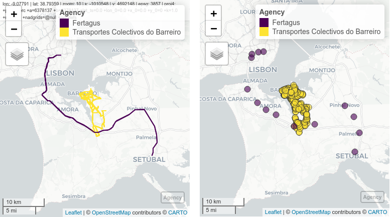
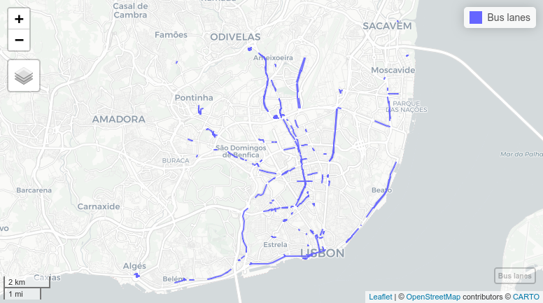

# GTFShift

<!-- badges: start -->
[](https://github.com/U-Shift/GTFShift/actions/workflows/pkgdown.yaml)
<!-- badges: end -->

**GTFShift** emerged from the necessity to understand how to get an
overview of where bus lanes should be prioritized for a given territory,
using General Transit Feed Specification (GTFS) and OpenStreetMap (OSM) data.

It provides a simple bundle for an aggregated analysis, that with one execution 
compiles in a few seconds the following indicators:

-   Frequency of buses (and trams) per hour and direction, at a peak hour;
-   Number of lanes in the same direction.

Together, these can be used to identify road segments where bus lanes should be implemented, 
enabling for a transparent and data-driven decision-making process, suitable to different contexts
and criteria. 

```r
library(GTFShift)
library(osmdata)

data = read.csv(system.file("extdata", "gtfs_sources_pt.csv", package = "GTFShift"))
gtfs_id = "lisboa"
gtfs = GTFShift::load_feed(data$URL[data$ID == gtfs_id], create_transfers=FALSE)
osm_q = opq(bbox=sf::st_bbox(tidytransit::shapes_as_sf(gtfs$shapes)))  |>
  add_osm_feature(key = "route", value = c("bus", "tram")) |>
  add_osm_feature(key = "network", value = "Carris", key_exact = TRUE)

lanes = prioritize_lanes(gtfs, osm_q)

mapview::mapview(
  lanes |> filter((frequency<5 | (is.na(n_lanes) | n_lanes_direction<=1)) & is_bus_lane),
  layer.name="Bus lane with -6 bus/h OR - 1 lane/dir",
  color="#DAD887"
) + mapview::mapview(
  lanes |> filter(frequency>=5 & !is.na(n_lanes) & n_lanes_direction>1 & is_bus_lane),
  layer.name="Bus lane with +5 bus/h + 1 lane/dir",
  color="#3BC1A8"
) + mapview::mapview(
  lanes |> filter(frequency>5 & !is.na(n_lanes) & n_lanes_direction>1 & !is_bus_lane),
  layer.name="NO bus lane with +5 bus/h + 1 lane/dir",
  color="#F63049"
)
```


> Example of bus lane prioritization analysis for Lisbon city, considering road segments with
a minimum frequency of 5 buses/hour and more than 1 lane per direction. 

## Installation

You can install the development version of **GTFShift** from
[GitHub](https://github.com/) with:

``` r
# install.packages("remotes")
remotes::install_github("U-Shift/GTFShift")
```

## Load the package

``` r
library(GTFShift)
```

## Key functions

**GTFShift** provides methods for the entire workflow of bus network
density analysis. For detailed examples on their functionality, refer to
the articles at <https://u-shift.github.io/GTFShift/>.

### Getting transit data

Starting with a valid GTFS feed is the key for a successful analysis.
**GTFShift** includes a method to load feeds that simultaneously scans
for any integrity errors and fixes them automatically.

If the feed location is unknown, it also provides a database listing
GTFS for Portugal and a method to query worldwide open catalogues by
city or country names or even a bounding box.

### Filter

GTFS feeds do not have a defined scope regarding its coverage of the
transportation system. Some can be bounded to one agency, whereas others
can aggregate several modes in the same city, or even national wise.

From the simpler to the most complex feeds, some analysis require to
narrow the perspective. **GTFShift** provides some to help in this
process.

### Aggregate

Public transit analysis takes advantage of the standardized GTFS format.
However, its provision by operator makes it difficult for network
aggregated analysis, considering connectivity and multimodality.

**GTFShift** includes a method to easily generate an aggregated GTFS
file given several instances.



> Aggregated GTFS for Fertagus and Transportes Coletivos do Barreiro
> operators

### Analyse

Analyzing public transit feeds is important to understand its
territorial coverage and dynamics, both on its spatial and temporal
dimensions.

**GTFShift** provides several methods that encapsulate pre-defined
methodologies for them, for instance, analysing hourly frequency per
stop, route or road segment.


> Aggregated route frequency for Carris Lisboa operator, at 8:00

### OSM Data

OpenStreetMaps (OSM) is an important data source for transit analysis,
due to its rich, open, and detailed geographic data.

**GTFShift** includes some methods that allow to access its information
directly, namely to export bus lanes, get centerlines for the road
network and export the OSM transit routes.



> OSM exported bus lanes for Lisbon

## Related packages

-   [`{tidytransit}`](https://github.com/r-transit/tidytransit)
-   [`{gtfstools}`](https://github.com/ipeaGIT/gtfstools/)
-   [`{GTFSwizard}`](https://github.com/nelsonquesado/GTFSwizard)
-   [`{gtfsrouter`}](https://github.com/UrbanAnalyst/gtfsrouter)

## Acknowledgement

**GTFShift** is developed and maintained by
[U-shift](https://ushift.tecnico.ulisboa.pt) urban mobility research
group, part of [CERIS](https://ceris.pt/) research unit, at [Instituto
Superior Técnico](https://tecnico.ulisboa.pt/pt/), Lisbon, Portugal.

<br/>


