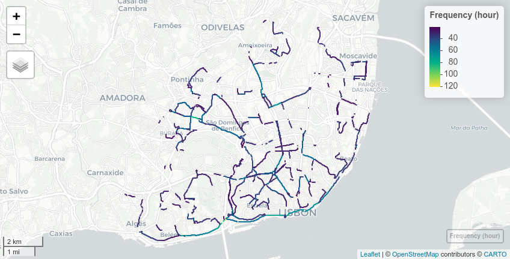

# GTFShift

<!-- badges: start -->
<!-- badges: end -->

GTFShift emerged from the necessity to understand how to get an overview of where bus lanes 
should be prioritized for a given territory, using General Transit Feed Specification (GTFS) files.

It compiles the methods developed for this purpose, aiming to contribute to an open source culture.

## Installation

You can install the development version of GTFShift from [GitHub](https://github.com/) with:

``` r
# install.packages("remotes")
remotes::install_github("U-Shift/GTFShift")
```

## Load the package

```{r setup}
library(GTFShift)
```

## Key functions

GTFShift provides methods for the entire workflow of bus network density analysis. 
For detailed examples on their functionality, refer to the articles at https://u-shift.github.io/GTFShift/.

### Getting transit data

Starting with a valid GTFS feed is the key for a successful analysis. 
GTFShift includes a method to load feeds that simultaneously scans for any integrity errors and fixes them automatically. 

If the feed location is unknown, it also provides a database listing GTFS for Portugal and a method to query worldwide open catalogues
by city or country names or even a bounding box.

### Filter

GTFS feeds do not have a defined scope regarding its coverage of the transportation system. 
Some can be bounded to one agency, whereas others can aggregate several modes in the same city, or even national wise.

From the simpler to the most complex feeds, some analysis require to narrow the perspective. GTFShift provides some to help in this process.

### Aggregate 

Public transit analysis takes advantage of the standardized GTFS format. 
However, its provision by operator makes it difficult for network aggregated analysis, considering connectivity and multimodality. 

GTFShift includes a method to easily generate an aggregated GTFS file given several instances.


> Aggregated GTFS for Fertagus and Transportes Coletivos do Barreiro operators

### Analyse

Analyzing public transit feeds is important to understand its territorial coverage and dynamics, both on its spatial and temporal dimensions. 

GTFShift provides several methods that encapsulate pre-defined methodologies for them, for instance, analysing hourly frequency per stop, route 
or road segment.


> Aggregated route frequency for Carris Lisboa operator, at 8:00

### OSM Data

OpenStreetMaps (OSM) is an important data source for transit analysis, due to its rich, open, and detailed geographic data. 

GTFShift includes some methods that allow to access its information directly, namely to export bus lanes, get centerlines for the 
road network and export the OSM transit routes.


> OSM exported bus lanes for Lisbon

