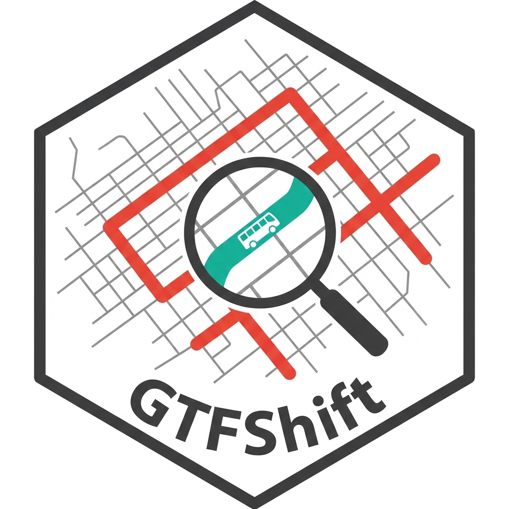
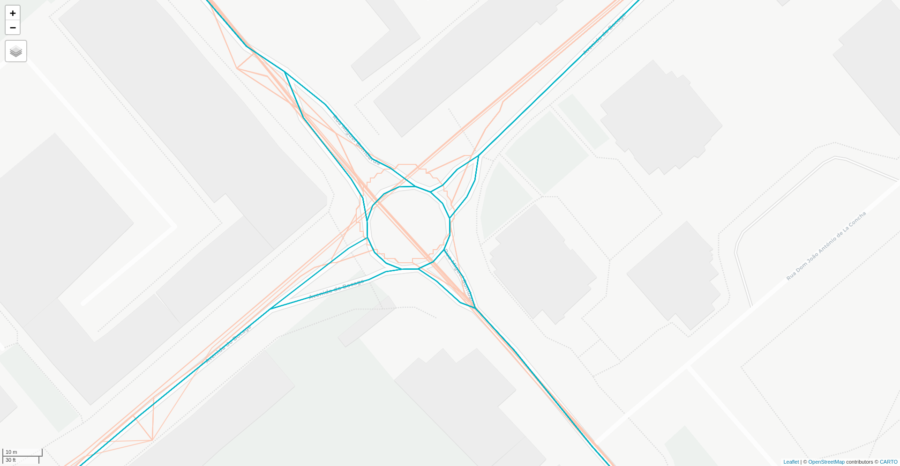
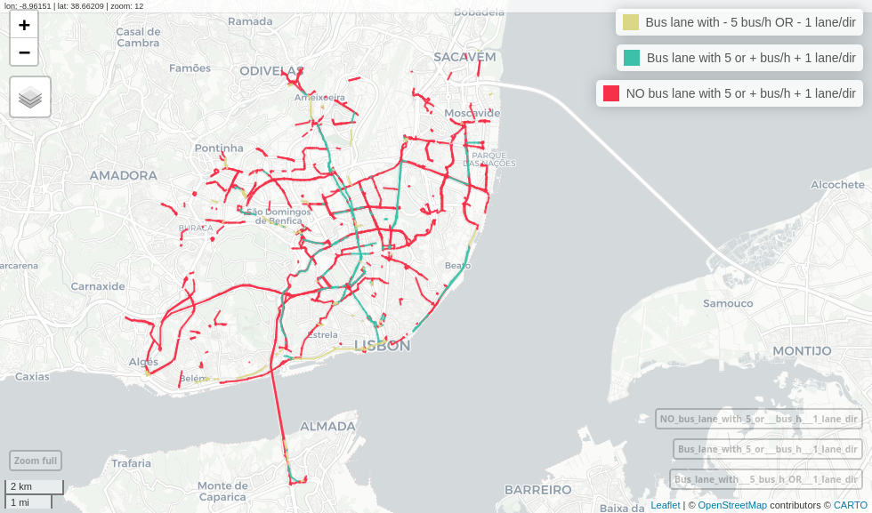

# GTFShift 

<!-- badges: start -->
[](https://github.com/U-Shift/GTFShift/actions/workflows/pkgdown.yaml) [](https://doi.org/10.5281/zenodo.21292010)
<!-- badges: end -->

**GTFShift** encompasses a complete bundle of methods to harmonize GTFS and OSM data, enabling the integration and exploration of different layers of transit data, starting with the planned operations (GTFS), but also the infrastructure topology (OSM) and real-time information (GTFS-RT).

## Installation

You can install the development version of **GTFShift** from
[GitHub](https://github.com/) with:

``` r
# install.packages("remotes")
remotes::install_github("U-Shift/GTFShift")
```

## Load the package

``` r
library(GTFShift)
```

## Get started

For more details on the package and how to get started, please visit the [Get started](https://u-shift.github.io/GTFShift/articles/GTFShift.html) page.


## Main use cases 

### Harmonize GTFS geometries with OSM data 

The lack of standardization on GTFS shape geometries hampers aggregated analysis of different feeds and the association of planned service information with other urban dimensions such as the infrastructure topology.

To solve this problem, **GTFShift** provides a bundle of methods to harmonize GTFS shapes with OSM road network geometries. Refer to [Get OSM data for bus routes](articles/osm.html#get-osm-data-for-bus-routes) and [Generate GTFS with OSM geometries](articles/gtfs_from_osm.html) for more details.



> Example of GTFS original shapes (salmon) and harmonized GTFS shapes with OSM data (blue) for TCB, Barreiro, Portugal

### Bus Lane Prioritization

**GTFShift** emerged from the necessity to understand how to get an
overview of where bus lanes should be prioritized for a given territory,
using General Transit Feed Specification (GTFS) and OpenStreetMap (OSM) data.

It provides a comprehensive bundle of methods that cover several dimensions of this 
problem, namely:

-   Frequency of buses (and trams) per hour and direction, at a peak hour;
-   Number of lanes in the same direction;
-   Existing traffic conditions;
-   Existing bus lanes in the area (from a network continuity perspective).

Together, these can be used to identify road segments where bus lanes should be implemented, 
enabling for a transparent and data-driven decision-making process, suitable to different contexts
and criteria. 



> Example of bus lane prioritization analysis for Lisbon city, considering road segments with
a minimum frequency of 10 buses/hour, average commercial speed below 9.7 km/h and more than 1 lane per direction. 

#### Dashboard 

**GTFShift** provides an interactive dashboard that allows users to explore and visualize results for real case studies, 
aiming to illustrate its potential and capabilities to a non-technical audience, while disseminating the outputs of these real world scenarios.

Visit it at [ushift.pt/apps/gtfshift](https://ushift.pt/apps/gtfshift).

[](https://ushift.pt/apps/gtfshift)

## Related packages

-   [`{tidytransit}`](https://github.com/r-transit/tidytransit)
-   [`{gtfstools}`](https://github.com/ipeaGIT/gtfstools/)
-   [`{gtfsrouter`}](https://github.com/UrbanAnalyst/gtfsrouter)
-   [`{GTFSwizard}`](https://github.com/nelsonquesado/GTFSwizard)

## Acknowledgement

**GTFShift** is developed and maintained by
[U-Shift](https://ushift.tecnico.ulisboa.pt) urban mobility research
group, part of [CERIS](https://ceris.pt/) research unit, at [Instituto
Superior Técnico](https://tecnico.ulisboa.pt/pt/), Lisbon, Portugal.

<br/>


