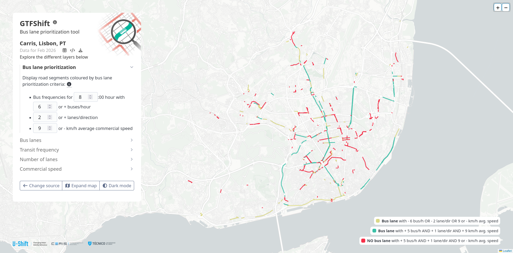

# GTFShift

**GTFShift** emerged from the necessity to understand how to get an
overview of where bus lanes should be prioritized for a given territory,
using General Transit Feed Specification (GTFS) and OpenStreetMap (OSM)
data.

It provides a comprehensive bundle of methods that cover several
dimensions of this problem, namely:

- Frequency of buses (and trams) per hour and direction, at a peak hour;
- Number of lanes in the same direction;
- Existing traffic conditions;
- Existing bus lanes in the area (from a network continuity
  perspective).

Together, these can be used to identify road segments where bus lanes
should be implemented, enabling for a transparent and data-driven
decision-making process, suitable to different contexts and criteria.


> Example of bus lane prioritization analysis for Lisbon city,
> considering road segments with a minimum frequency of 10 buses/hour,
> average commercial speed below 9.7 km/h and more than 1 lane per
> direction.

## Installation

You can install the development version of **GTFShift** from
[GitHub](https://github.com/) with:

``` r
# install.packages("remotes")
remotes::install_github("U-Shift/GTFShift")
```

## Load the package

``` r
library(GTFShift)
```

## Get started

For more details on the package and how to get started, please visit the
[Get started](https://u-shift.github.io/GTFShift/articles/GTFShift.html)
page.

## Dashboard

**GTFShift** provides an interactive dashboard that allows users to
explore and visualize results for real case studies, aiming to
illustrate its potential and capabilities to a non-technical audience,
while disseminating the outputs of these real world scenarios.

Visit it at [ushift.pt/apps/gtfshift](https://ushift.pt/apps/gtfshift).

[](https://ushift.pt/apps/gtfshift)

## Related packages

- [`{tidytransit}`](https://github.com/r-transit/tidytransit)
- [`{gtfstools}`](https://github.com/ipeaGIT/gtfstools/)
- [`{GTFSwizard}`](https://github.com/nelsonquesado/GTFSwizard)
- [`{gtfsrouter`}](https://github.com/UrbanAnalyst/gtfsrouter)

## Acknowledgement

**GTFShift** is developed and maintained by
[U-Shift](https://ushift.tecnico.ulisboa.pt) urban mobility research
group, part of [CERIS](https://ceris.pt/) research unit, at [Instituto
Superior Técnico](https://tecnico.ulisboa.pt/pt/), Lisbon, Portugal.

  


