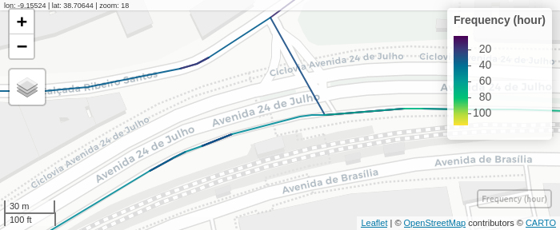

<style>
.leaflet-container {
  width: 100% !important;
  min-width: 0 !important;
  box-sizing: border-box;
}
</style>

```{r, include = FALSE}
knitr::opts_chunk$set(
  collapse = TRUE,
  comment = "#>"
)
```

```{r setup, message=FALSE}
knitr::opts_chunk$set(warning = FALSE, message = FALSE)
library(GTFShift)

library(tidytransit)
library(mapview)
library(sf)
library(dplyr)
```


# Introduction 

Analyzing public transit feeds is important to understand its territorial coverage and dynamics, both on its spatial and temporal dimensions. `GTFShift` provides several methods that encapsulate pre-defined methodologies for them. This document explores their applicability with simple examples.

> This article uses a GTFS feed from the library GTFS database for Portugal as an example. Refer to the
[vignette("download")](./download) for more details.

```{r}
# Get GTFS from library GTFS database for Portugal
data <- read.csv(system.file("extdata", "gtfs_sources_pt.csv", package = "GTFShift"))
gtfs_id = "lisboa"
gtfs <- GTFShift::load_feed(data[data$ID==gtfs_id,]$URL)
```


# Analyse hourly frequency per stop

To analyse frequencies at stops, use `GTFShift::get_stop_hour_frequency()`, producing, for each, an aggregated counting of bus servicing it per hour.

```{r}
# Perform frequency analysis
frequencies_stop <- GTFShift::get_stop_frequency_hourly(gtfs)
summary(frequencies_stop)
```

Its returns an `sf` `data.frame` that can be displayed using mapview, or stored in GeoPackage format.

```{r}
# Display map
mapview::mapview(frequencies_stop, zcol="frequency", legend=TRUE, cex=4, layer.name = "Frequency (hour)")

# Store in GeoPackage format
st_write(frequencies_stop, "database/transit/bus_stop_frequency.gpkg", append=FALSE)
```


# Analyse hourly frequency per route

The frequency analysis can also be performed route wise. For this purpose, use `GTFShift::get_route_hour_frequency()`, returning aggregated results per hour.

The analysis can be performed for each route individually.
```{r}
frequencies_route <- GTFShift::get_route_frequency_hourly(gtfs)
summary(frequencies_route)
```

The `overline` parameter allows for an even more aggregated screening of the operation, clustering routes that overlap and converting them into a single route network. This allows for a better visualization of the volumes of frequencies per each segment of the network.

```{r}
frequencies_route_overline <- GTFShift::get_route_frequency_hourly(gtfs, overline=TRUE)
summary(frequencies_route_overline)
```

<div style="display: flex; gap: 20px; overflow-x: auto;">
<div style="flex: 1 1 0; min-width: 288px; max-width: 100%;">
### Aggregated routes for 8 a.m.
```{r}
mapview::mapview(
  frequencies_route %>% filter(arrival_hour==8 & frequency > 2),
  zcol = "frequency",
  layer.name = "Frequency (hour)"
)
```
</div>
<div style="flex: 1 1 0; min-width: 288px; max-width: 100%;">
### Aggregated routes with overline for 8 a.m.
```{r}
# above 2 per hour
mapview::mapview(
  frequencies_route_overline %>% filter(arrival_hour==8 & frequency > 2),
  zcol = "frequency",
  layer.name = "Frequency (hour)"
)
```
</div>
</div>

## Improve visualization with `GTFShift::network_overline`

Using the `overline` attribute in `GTFShift::get_route_frequency_hourly()` might not be the best option if the GTFS shapes do not share exactly the same geometry. In those cases, the overlapping lines might not be merged correctly, causing inconsistent results, such as a street with different frequencies along it, despite not having any bus stop in between those differences.



This is a [known issue](https://github.com/ropensci/stplanr/issues/575) of `stplanr::overline2()`, the method used for the network aggregation that has not been solved yet.

As an alternative, `GTFShift` provides the method `GTFShift::network_overline()`, that allows for the route aggregation. Given a simplified network, it identifies the segments corresponding to each route and uses them to aggregate the attribute defined in the parameters. It can be used to aggregate the frequencies. 

> One approach for the network simplification could be through the centerlines determination. During the development of this project, no R packages were found suiting this purpose. [Centerline](https://github.com/atsyplenkov/centerline) package has this feature in its roadmap. Currently, there are available solutions for [Python](https://uscuni.org/neatnet/index.html) or [ArcGis](https://pro.arcgis.com/en/pro-app/latest/tool-reference/cartography/merge-divided-roads.htm).

Below is provided an example, that uses the centerlines for the Carris network as a simplification, generated in an external tool.

```{r}
network <- sf::st_read(system.file("extdata", "centerline_carris.gpkg", package = "GTFShift"))

frequencies_route_overline_improved = GTFShift::network_overline(
  network, 
  frequencies_route %>% filter(arrival_hour==8),
  attr = "frequency"
)

mapview::mapview(
  frequencies_route_overline_improved %>% filter(frequency > 2),
  zcol = "frequency",
  layer.name = "Frequency (hour)"
)
```

