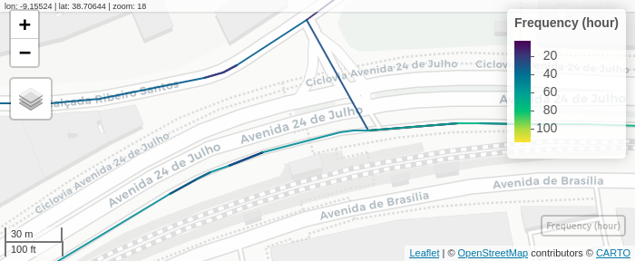

<style>
.leaflet-container {
  width: 100% !important;
  min-width: 0 !important;
  box-sizing: border-box;
}
</style>

```{r, include = FALSE}
knitr::opts_chunk$set(
  warning = FALSE,
  message = FALSE,
  collapse = TRUE,
  cache = TRUE,
  comment = "#>"
)
```

```{r setup, cache=FALSE}
library(GTFShift)
library(tidytransit)
library(mapview)
library(sf)
library(dplyr)
```


# Introduction 

Analyzing public transit feeds is important to understand its territorial coverage and dynamics, both on its spatial and temporal dimensions. `GTFShift` provides several methods that encapsulate pre-defined methodologies for them. This document explores their applicability with simple examples.

> This article uses a GTFS feed from the library GTFS database for Portugal as an example. Refer to the
[vignette("download")](./download) for more details.

```{r}
# Get GTFS from library GTFS database for Portugal
data = read.csv(system.file("extdata", "gtfs_sources_pt.csv", package = "GTFShift"))
gtfs_id = "lisboa"
gtfs = GTFShift::load_feed(data$URL[data$ID == gtfs_id], create_transfers=FALSE)
```


# Analyse network extension

To analyse the extension of a transit network, use `GTFShift::get_network_extension()`, which computes the total length of all routes in the GTFS feed, considering, for each, the shape of the variant with the highest frequency for a given date.

> In this example, we intend to get a value close to the official 757 km [reported by Carris](https://www.carris.pt/media/ikvdezmc/relat%C3%B3rio-e-contas-carris-2024.pdf){target="_blank"}. For this purpose, we use parameters `direction_wise=TRUE` to consider both directions for each route, but removing route overlaps (with `unified=TRUE`). Additionally, we use OSM open data to get more accurate route geometries (through parameter `use_osm_routes`).

```{r}
library(osmdata)
library(units)

osm_q = opq(bbox=sf::st_bbox(tidytransit::shapes_as_sf(gtfs$shapes)))  |>
  add_osm_feature(key = "route", value = c("bus", "tram")) |>
  add_osm_feature(key = "network", value = "Carris", key_exact = TRUE)

route_extent_carris = get_network_extension(gtfs, route_identifier="route_short_name", direction_wise = TRUE, use_osm_routes = osm_q, unified = TRUE)
drop_units(route_extent_carris/1000)
```


# Analyse hourly frequency per stop

To analyse frequencies at stops, use `GTFShift::get_stop_frequency_hourly()`, producing, for each, an aggregated counting of bus servicing it per hour.

> By default, the analysis is performed for next business Wednesday, in Portugal. Refer to `GTFShift::calendar_nextBusinessWednesday()`, for more details. You can override this, using `date` parameter.

```{r}
# Perform frequency analysis
frequencies_stop = GTFShift::get_stop_frequency_hourly(gtfs)
summary(frequencies_stop)
```

Its returns an `sf` `data.frame` that can be displayed using mapview, or stored in GeoPackage format.

```{r, cache=FALSE}
# Display map
mapview::mapview(
  frequencies_stop |>
    filter(hour == 8 &
           frequency > 2),
  zcol = "frequency",
  legend = TRUE,
  cex = 4,
  layer.name = "Frequency (hour)"
)

# Store in GeoPackage format
# st_write(frequencies_stop, "database/transit/bus_stop_frequency.gpkg", append=FALSE, quiet = TRUE)
```


# Analyse hourly frequency per road segment

To analyse frequencies at road segments, use `GTFShift::get_way_frequency_hourly()`, returning aggregated results per hour and road segment, using OSM ways.

> Mind that routs without an OSM match are ignored. Refer to `GTFShift::osm_shapes_to_routes()` for more details.

```{r}
frequencies_way = GTFShift::get_way_frequency_hourly(gtfs, osm_q)
summary(frequencies_way)
quantile(frequencies_way$frequency)
```

It returns an `sf` `data.frame` that can be displayed using mapview.

```{r, cache=FALSE}
mapview::mapview(
  frequencies_way |> filter(hour == 8 & frequency > 2),
  zcol = "frequency",
  layer.name = "Frequency (hour)"
)
```

# Analyse hourly frequency per route

The frequency analysis can also be performed route wise. For this purpose, use `GTFShift::get_route_frequency_hourly()`, returning aggregated results per hour and route.

The analysis can be performed for each route individually.

> By default, the analysis is performed for next business Wednesday, in Portugal. Refer to `GTFShift::calendar_nextBusinessWednesday()`, for more details. You can override this, using `date` parameter.

```{r}
frequencies_route = GTFShift::get_route_frequency_hourly(gtfs)
summary(frequencies_route)
quantile(frequencies_route$frequency)
```

The `overline` parameter allows for an even more aggregated screening of the operation, clustering routes that overlap and converting them into a single route network. This allows for a better visualization of the volumes of frequencies per each segment of the network and can help prioritizing interventions in the network.

```{r}
frequencies_route_overline = GTFShift::get_route_frequency_hourly(gtfs, overline = TRUE)
summary(frequencies_route_overline)
quantile(frequencies_route_overline$frequency)
```


<div style="display: flex; gap: 20px; overflow-x: auto;">
<div style="flex: 1 1 0; min-width: 288px; max-width: 100%;">

### Aggregated frequencies for 8 a.m.

```{r, cache=FALSE}
mapview::mapview(
  frequencies_route |> filter(hour == 8 & frequency > 2),
  zcol = "frequency",
  layer.name = "Frequency (hour)"
)
```

</div>
<div style="flex: 1 1 0; min-width: 288px; max-width: 100%;">

### Aggregated frequencies for routes overline for 8 a.m.

```{r, cache=FALSE}
# above 2 per hour
mapview::mapview(
  frequencies_route_overline |> filter(
    hour == 8 &
      frequency > 2 # optional
  ),
  zcol = "frequency",
  # lwd = "frequency",
  layer.name = "Frequency (hour)"
)
```

</div>
</div>


## Improve visualization

Using the `overline` attribute in `GTFShift::get_route_frequency_hourly()` might not be the best option if the GTFS shapes do not share exactly the same geometry. In those cases, the overlapping lines might not be merged correctly, causing inconsistent results, such as a street with different frequencies along it, despite not having any bus stop in between those differences.




This is a [known issue](https://github.com/ropensci/stplanr/issues/575) of `stplanr::overline2()`, the method used for the network aggregation that has not been solved yet.

As an alternative, `GTFShift` provides some methods that allow to overcome this issue, by correcting its geometry or aggregating the network with open data.


### Correcting geometry with OSM open data

GTFShift offers several methods that allow to get routes geometry from OpenStreetMaps. Refer to [vignette("osm")](osm.html#get-osm-bus-routes) for more details.


### Aggregating the network with OSM open data

There are several methods to aggregate a transit network. One approach is through the determination of the centerlines of the roads where the vehicles operate. GTFShift provides a method that encapsulates Python [neatnet](https://uscuni.org/neatnet/index.html) package for this purpose. Refer to [vignette("osm")](osm.html#get-centerlines-for-osm-road-network) for more details.

> During the development of this project, no R packages were found suiting this purpose. [Centerline](https://github.com/atsyplenkov/centerline) package has this feature in its roadmap. Currently, there are available solutions for [Python](https://uscuni.org/neatnet/index.html) or [ArcGis](https://pro.arcgis.com/en/pro-app/latest/tool-reference/cartography/merge-divided-roads.htm).


## Aggregating frequencies over a target network

As an alternative to the `GTFShift::get_route_frequency_hourly()` method using the `overline=TRUE` parameter, `GTFShift::network_overline()` provides a different frequency aggregation functionality.

Given a target network, it identifies the segments corresponding to each route and uses them to aggregate the attribute defined in the parameters.

Below is provided an example, that uses the centerlines for the Carris network as a target network, generated using [ArcGis](https://pro.arcgis.com/en/pro-app/latest/tool-reference/cartography/merge-divided-roads.htm).

```{r}
network = sf::st_read(
  system.file("extdata", "centerline_carris.gpkg", package = "GTFShift"), 
  quiet = TRUE
)

frequencies_route_overline_improved = GTFShift::network_overline(
  network, 
  frequencies_route |> filter(hour == 8),
  attr = "frequency"
)

quantile(frequencies_route_overline_improved$frequency)
```

```{r, cache=FALSE}
mapview::mapview(
  frequencies_route_overline_improved |> filter(frequency > 20),
  zcol = "frequency",
  layer.name = "Frequency (hour)"
)
```

