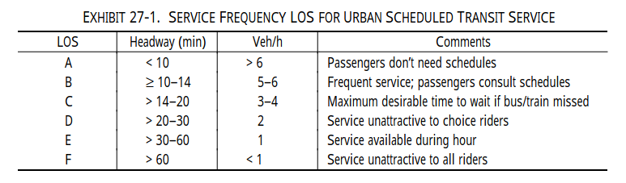

<style>
.leaflet-container {
  width: 100% !important;
  min-width: 0 !important;
  box-sizing: border-box;
}
</style>

```{r, include = FALSE}
knitr::opts_chunk$set(
  warning = FALSE,
  message = FALSE,
  collapse = TRUE,
  cache = TRUE,
  comment = "#>"
)
```

```{r setup, cache=FALSE}
library(GTFShift)
library(tidytransit)
library(mapview)
library(sf)
library(dplyr)
```

```{r include=FALSE}
Sys.sleep(60)
```


# Introduction

Data classification helps to categorize transit data into meaningful groups based on specific criteria or thresholds. This process is essential for interpreting complex datasets, enabling transit planners and analysts to make informed decisions regarding service improvements, resource allocation, and policy development. `GTFShift` provides methods that encapsulate methodologies for this purpose. This document explores their applicability with simple examples.

> This article uses a GTFS feed from the library GTFS database for Portugal as an example. Refer to the
[vignette("download")](./download) for more details.

```{r}
# Get GTFS from library GTFS database for Portugal
data = read.csv(system.file("extdata", "gtfs_sources_pt.csv", package = "GTFShift"))
gtfs_id = "barreiro"
gtfs = GTFShift::load_feed(data$URL[data$ID == gtfs_id], create_transfers=FALSE)
```

# Bus frequency LOS

Bus frequency level of service (LOS) classification is a methodology used to evaluate the quality of bus services based on their frequency. The classification is based on the Highway Capacity Manual (HCM) 2000 guidelines on "Service Frequency LOS for Urban Scheduled Transit Service" (Exhibit 27-1), implemented in `GTFShift::classify_frequency_los()`. 

The LOS categories range from A to F, with A representing the highest level of service (most frequent buses) and F representing the lowest level of service (least frequent buses).



Note that this method is an adaptation of the original method, as it originally classifies LOS based on headway (time) and not frequency (number of buses per hour), being this last one a proxy.

Also, mind that HCM states that "LOS is determined by destination from a given transit stop, since several routes may serve a given stop but not all may serve a particular destination". Applications of this method to other scenarios should consider this aspect.

```{r}
# Get route frequency analysis
frequency_analysis = GTFShift::get_route_frequency_hourly(gtfs)

# Classify frequency level of service
frequency_los = GTFShift::classify_frequency_los(frequency_analysis)

frequency_los

table(frequency_los$frequency_los)
```

```{r, cache=FALSE}
mapview::mapview(
  frequency_los |> filter(hour == 8),
  zcol = "frequency_los",
  layer.name = "Bus Frequency LOS at 8 AM"
)
```


