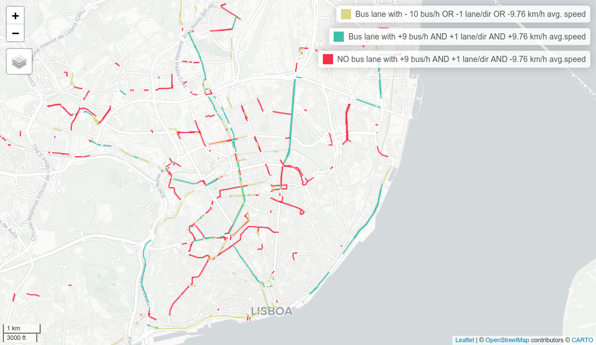

<style>
.leaflet-container {
  width: 100% !important;
  min-width: 0 !important;
  box-sizing: border-box;
}
</style>

```{r, include = FALSE}
knitr::opts_chunk$set(
  warning = FALSE,
  message = FALSE,
  collapse = TRUE,
  cache = TRUE,
  comment = "#>"
)
```

```{r setup, cache=FALSE}
library(GTFShift)
```

# Introduction

GTFS-RT extends the GTFS static data model by providing real time operational information. From service alerts, to trip updates, but also vehicle positions. The collection of this data can provide valuable insights about how planned operation performs in practice. `GTFShift` provides several methods to enable this data collection and analysis.


# Collect GTFS-RT data

To collect GTFS-RT data, use `GTFShift::rt_collect_json()` or `GTFShift::rt_collect_protobuf()`, depending on the encoding the feed uses (JSON or Protocol Buffers, respectively). These fetch GTFS-RT data from the endpoint and save it to a CSV file for further analysis. The method runs in a loop, fetching data at regular intervals (default is every 60 seconds) until manually stopped (CTRL+C).

```{r, eval=FALSE}
rt_collect_file <- "gtfs_rt_data.csv"
GTFShift::rt_collect_json("https://api.example.com/gtfs-rt", rt_collect_file)
```

`GTFS::rt_collect_protobuf()` is an alternative method for GTFS-RT feeds using Protocol Buffers encoding.

# Extend prioritization with GTFS-RT data

Once GTFS-RT data is collected, it can be used to extend lane prioritization analysis. `GTFShift::rt_extend_prioritization()` takes a lane prioritization data frame and a GTFS-RT collection (as an `sf` object) and enriches the prioritization with real-time metrics. Refer to the method documentation for the full details.

```{r, eval=FALSE}
lane_prioritization <- GTFShift::prioritize_lanes(gtfs, osm_query)

rt_collection <- read.csv(rt_collect_file) |> sf::st_as_sf(coords = c("longitude", "latitude"), crs = 4326)

lane_prioritization_extended <- GTFShift::rt_extend_prioritization(
  lane_prioritization = lane_prioritization,
  rt_collection = rt_collection
)
```

The resulting `lane_prioritization_extended` data frame includes additional columns with speed metrics, such as average speed, median speed, and speed percentiles, providing a more comprehensive view of lane performance based on real-time data.

```{r, eval=FALSE}
lane_prioritization_0800 = lane_prioritization_extended |> filter(hour==8)

mapview::mapview(
  lane_prioritization_0800,
  zcol = "speed_avg",
  layer.name = "Average speed per lane"
)

p50_frequency = quantile(lane_prioritization_0800$frequency, 0.5, na.rm=TRUE)
p50_speed = quantile(lane_prioritization_0800$speed_avg, 0.5, na.rm=TRUE)
mapview::mapview(
  lane_prioritization_0800 |> filter(is_bus_lane & (frequency<p50_frequency | (is.na(n_lanes) | n_lanes_direction<=1) | speed_avg<=p50_speed)),
  layer.name=sprintf("Bus lane with - %d bus/h OR -1 lane/dir OR -%.2f km/h avg. speed", p50_frequency, p50_speed),
  color="#DAD887"
) + mapview::mapview(
  lane_prioritization_0800 |> filter(is_bus_lane & frequency>=p50_frequency & !is.na(n_lanes) & n_lanes_direction>1 & speed_avg>p50_speed),
  layer.name=sprintf("Bus lane with +%d bus/h AND +1 lane/dir AND +%.2f km/h avg.speed", p50_frequency-1, p50_speed),
  color="#3BC1A8"
) + mapview::mapview(
  lane_prioritization_0800 |> filter(!is_bus_lane & frequency>=p50_frequency & !is.na(n_lanes) & n_lanes_direction>1 & speed_avg<=p50_speed),
  layer.name=sprintf("NO bus lane with +%d bus/h AND +1 lane/dir AND -%.2f km/h avg.speed", p50_frequency-1, p50_speed),
  color="#F63049"
)
```



